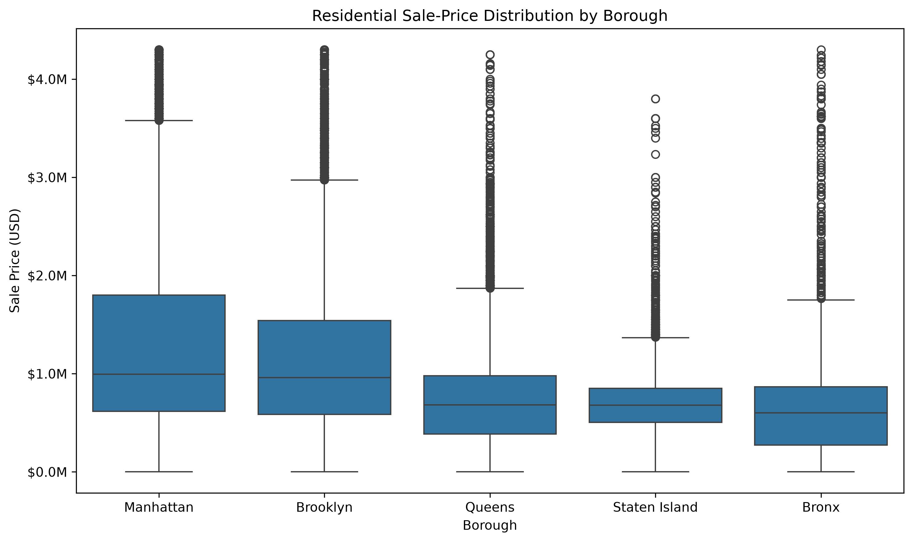
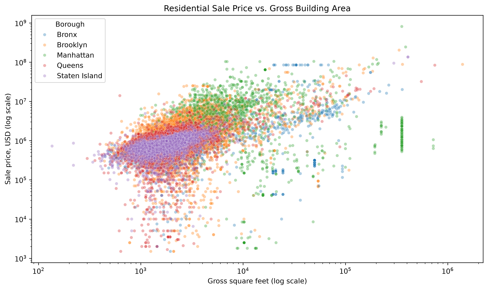
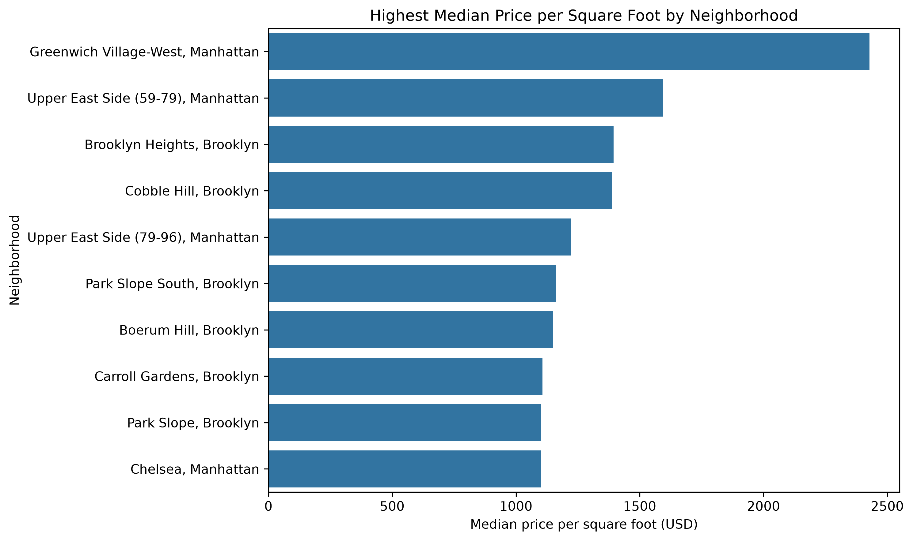

# NYC Property Sales Analysis: 2024–2025

## Overview

This project analyzes residential property sales across New York City's five boroughs using annual property sales data published by the New York City Department of Finance.

The analysis covers 2024 and 2025 and combines ten borough-level source files into a single analytical dataset. The project demonstrates a complete exploratory data science workflow, including source-data inspection, multi-file integration, data cleaning, validation, descriptive statistics, visualization, and evidence-based interpretation.

## Research Question

**How do property size, location, and property characteristics relate to residential sale prices across New York City's five boroughs, and how did these patterns differ between 2024 and 2025?**

Supporting questions include:

- How do residential sale-price distributions differ across NYC's five boroughs?
- What relationship exists between property size and sale price, and does it differ by borough?
- How does price per square foot vary across boroughs and neighborhoods?
- How do sale prices differ across residential property categories?
- How did observed residential sale prices and transaction activity differ between 2024 and 2025?
- Are relationships between property characteristics and sale price consistent across boroughs?

## Data

The project uses annualized property sales data published by the **New York City Department of Finance**.

Ten source files are used:

| Year | Boroughs                                          |
| ---- | ------------------------------------------------- |
| 2024 | Manhattan, Bronx, Brooklyn, Queens, Staten Island |
| 2025 | Manhattan, Bronx, Brooklyn, Queens, Staten Island |

The source files contain property characteristics, building classifications, transaction dates, recorded sale prices, and building-area information.

After removing the single blank record present in each workbook, the integrated dataset contains **163,311 property-sale records**.

Raw and processed datasets are intentionally excluded from version control. The analysis is designed to be reproduced from the official source files.

## Methodology

The project follows a structured exploratory data science workflow:

1. Inspect the structure and quality of each source workbook.
2. Standardize schemas, column names, and data types.
3. Identify missing, invalid, and duplicate observations.
4. Preserve borough and year provenance for every transaction.
5. Combine the ten cleaned borough datasets.
6. Validate borough codes, transaction years, and analytical fields.
7. Define residential analytical populations appropriate to each research question.
8. Examine sale-price distributions across boroughs and property categories.
9. Compare transaction activity and recorded prices between 2024 and 2025.
10. Analyze the relationship between gross building area and sale price.
11. Compare price per square foot across boroughs and neighborhoods.
12. Evaluate whether property-price relationships are consistent across boroughs.

The analysis is observational. Relationships identified in the data are interpreted as associations rather than causal effects.

## Key Findings

Across **97,849 residential positive-price sales**, recorded prices varied substantially by borough and property category.

- Manhattan had the highest borough median sale price at approximately **$1.20 million**, followed by Brooklyn at **$985,000**.
- Queens and Staten Island had median sale prices of approximately **$690,000** and **$680,000**, while the Bronx had the lowest median at **$625,000**.
- Residential positive-price sales increased from **47,443 in 2024 to 50,406 in 2025**, an increase of approximately **6.25%**.
- The overall median recorded sale price increased from **$799,000 in 2024 to $840,500 in 2025**, an increase of approximately **5.19%**.
- Within the final size-based analytical subset, gross building area had a positive but relatively weak overall linear association with sale price (**Pearson r = 0.221**).
- The size-price relationship differed substantially by borough, ranging from **0.993 in Staten Island** and **0.816 in Queens** to **0.023 in Manhattan**.
- Median price per square foot among eligible transactions ranged from approximately **$591 in Manhattan** to **$356 in the Bronx**.
- Among neighborhoods with at least 50 eligible size-based transactions, **Greenwich Village-West** had the highest median price per square foot at approximately **$2,428**.
- Property-category price patterns also varied substantially across boroughs, showing that citywide summaries can conceal meaningful geographic differences.

## Visual Highlights

### Residential Sale-Price Distribution by Borough



Recorded residential sale prices are strongly right-skewed across all five boroughs, with substantial differences in their distributions.

### Property Size and Sale Price



Larger buildings generally have higher recorded sale prices, but the strength of the relationship varies substantially across boroughs.

### Neighborhood Price per Square Foot



Among borough-neighborhood groups with at least 50 eligible size-based sales, Greenwich Village-West had the highest median price per square foot.

## Analytical Considerations

Recorded sale price does not necessarily represent verified market value. Positive-price transactions may include non-arm's-length or otherwise unusual transfers.

Gross building area is also incomplete for large portions of the residential market. It is largely unavailable for condo and co-op transactions and has particularly limited coverage in Manhattan. Size and price-per-square-foot results therefore apply only to properties with usable building-area information.

For size-based analyses, one isolated **1-square-foot** record was excluded as an implausible denominator, and transactions with recorded sale prices of **$1,000 or less** were excluded after diagnostics identified a distinct cluster of nominal-price transactions. Large properties and high-value transactions were otherwise retained rather than removed solely because they were extreme.

Year-to-year comparisons are descriptive and may reflect changes in the composition of properties sold as well as changes in transaction values.

## Notebooks

| Notebook                             | Purpose                                                                                                                        |
| ------------------------------------ | ------------------------------------------------------------------------------------------------------------------------------ |
| `01_data_understanding.ipynb`        | Inspect source workbooks, schemas, missing values, duplicates, distributions, and initial data-quality issues                  |
| `02_data_cleaning_integration.ipynb` | Clean and standardize the source files, define analytical fields, integrate the datasets, and validate the combined data       |
| `03_exploratory_data_analysis.ipynb` | Analyze sale prices, transaction activity, property categories, building size, price per square foot, and geographic variation |

## Project Structure

```text
nyc-property-sales-analysis/
├── data/
│   ├── raw/
│   │   ├── 2024/
│   │   └── 2025/
│   └── processed/
├── docs/
│   └── data_dictionary.md
├── notebooks/
│   ├── 01_data_understanding.ipynb
│   ├── 02_data_cleaning_integration.ipynb
│   └── 03_exploratory_data_analysis.ipynb
├── reports/
│   └── figures/
├── .gitignore
├── .python-version
├── pyproject.toml
├── uv.lock
└── README.md
```

The `data/raw/` and `data/processed/` directories are excluded from version control.

## Tools

The project is developed in Python using a `uv`-managed environment.

Core tools include:

- Python
- pandas
- NumPy
- Matplotlib
- Seaborn
- Jupyter
- openpyxl

## Reproducibility

Clone the repository and install the project dependencies:

```bash
uv sync
```

Download the 2024 and 2025 annualized property sales workbooks for all five boroughs from the official NYC Department of Finance source.

Place the files in:

```text
data/raw/2024/
data/raw/2025/
```

Then run the notebooks in order:

```text
01_data_understanding.ipynb
02_data_cleaning_integration.ipynb
03_exploratory_data_analysis.ipynb
```

Notebook 2 creates the processed analytical dataset used by Notebook 3.

## Data Source

**New York City Department of Finance**  
Annualized Property Sales Data

https://www.nyc.gov/site/finance/property/property-annualized-sales-update.page

## Status

**Complete.**

The source-data understanding, cleaning and integration, exploratory analysis, documentation, and presentation figures are complete.

## Author

**Nkululeko Cyril Cele**
